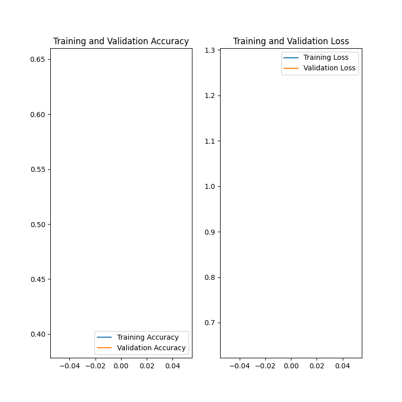

Confidence and Accuracy Report
==============================

# Model version number 2

## Threshold Value

The threshold value is 50.0.
## Confidence/Accuracy Above the Threshold

The average confidence level above the threshold is: 94.34036633302999

The average accuracy level above the threshold is: 0.5930232558139535

The data is in Appendix A
## Confidence/Accuracy Below the Threshold

The average confidence level below the threshold is: 0

The average accuracy level below the threshold is: 0

The data is in Appendix B
## Training Accuracy and Loss for Validation vs Training data
  

## Appendix A
Path to Image: C:\Users\tkwok7\PycharmProjects\gtriScreenClassification\testing_set\CatsDogs\cats\cat.1.jpg     
Confidence Level: 85.9870970249176      Predicted Label: cats   Actual Label: cats
Path to Image: C:\Users\tkwok7\PycharmProjects\gtriScreenClassification\testing_set\CatsDogs\cats\cat.10.jpg    
Confidence Level: 94.84054446220398     Predicted Label: cats   Actual Label: cats
Path to Image: C:\Users\tkwok7\PycharmProjects\gtriScreenClassification\testing_set\CatsDogs\cats\cat.11.jpg    
Confidence Level: 94.55156922340393     Predicted Label: cats   Actual Label: cats
Path to Image: C:\Users\tkwok7\PycharmProjects\gtriScreenClassification\testing_set\CatsDogs\cats\cat.12.jpg    
Confidence Level: 93.85063648223877     Predicted Label: cats   Actual Label: cats
Path to Image: C:\Users\tkwok7\PycharmProjects\gtriScreenClassification\testing_set\CatsDogs\cats\cat.13.jpg    
Confidence Level: 95.71884274482727     Predicted Label: cats   Actual Label: cats
Path to Image: C:\Users\tkwok7\PycharmProjects\gtriScreenClassification\testing_set\CatsDogs\cats\cat.14.jpg    
Confidence Level: 90.24544358253479     Predicted Label: cats   Actual Label: cats
Path to Image: C:\Users\tkwok7\PycharmProjects\gtriScreenClassification\testing_set\CatsDogs\cats\cat.15.jpg    
Confidence Level: 88.87675404548645     Predicted Label: cats   Actual Label: cats
Path to Image: C:\Users\tkwok7\PycharmProjects\gtriScreenClassification\testing_set\CatsDogs\cats\cat.16.jpg    
Confidence Level: 94.13105845451355     Predicted Label: cats   Actual Label: cats
Path to Image: C:\Users\tkwok7\PycharmProjects\gtriScreenClassification\testing_set\CatsDogs\cats\cat.17.jpg    
Confidence Level: 96.33083939552307     Predicted Label: cats   Actual Label: cats
Path to Image: C:\Users\tkwok7\PycharmProjects\gtriScreenClassification\testing_set\CatsDogs\cats\cat.18.jpg    
Confidence Level: 99.61063861846924     Predicted Label: cats   Actual Label: cats
Path to Image: C:\Users\tkwok7\PycharmProjects\gtriScreenClassification\testing_set\CatsDogs\cats\cat.19.jpg    
Confidence Level: 92.1143889427185      Predicted Label: cats   Actual Label: cats
Path to Image: C:\Users\tkwok7\PycharmProjects\gtriScreenClassification\testing_set\CatsDogs\cats\cat.2.jpg     
Confidence Level: 97.12637662887573     Predicted Label: cats   Actual Label: cats
Path to Image: C:\Users\tkwok7\PycharmProjects\gtriScreenClassification\testing_set\CatsDogs\cats\cat.20.jpg    
Confidence Level: 97.62586951255798     Predicted Label: cats   Actual Label: cats
Path to Image: C:\Users\tkwok7\PycharmProjects\gtriScreenClassification\testing_set\CatsDogs\cats\cat.21.jpg    
Confidence Level: 95.7425057888031      Predicted Label: cats   Actual Label: cats
Path to Image: C:\Users\tkwok7\PycharmProjects\gtriScreenClassification\testing_set\CatsDogs\cats\cat.22.jpg    
Confidence Level: 87.60369420051575     Predicted Label: cats   Actual Label: cats
Path to Image: C:\Users\tkwok7\PycharmProjects\gtriScreenClassification\testing_set\CatsDogs\cats\cat.23.jpg    
Confidence Level: 97.98664450645447     Predicted Label: cats   Actual Label: cats
Path to Image: C:\Users\tkwok7\PycharmProjects\gtriScreenClassification\testing_set\CatsDogs\cats\cat.24.jpg    
Confidence Level: 92.43178367614746     Predicted Label: cats   Actual Label: cats
Path to Image: C:\Users\tkwok7\PycharmProjects\gtriScreenClassification\testing_set\CatsDogs\cats\cat.25.jpg    
Confidence Level: 94.66441869735718     Predicted Label: cats   Actual Label: cats
Path to Image: C:\Users\tkwok7\PycharmProjects\gtriScreenClassification\testing_set\CatsDogs\cats\cat.26.jpg    
Confidence Level: 92.99613237380981     Predicted Label: cats   Actual Label: cats
Path to Image: C:\Users\tkwok7\PycharmProjects\gtriScreenClassification\testing_set\CatsDogs\cats\cat.27.jpg    
Confidence Level: 93.04814338684082     Predicted Label: cats   Actual Label: cats
Path to Image: C:\Users\tkwok7\PycharmProjects\gtriScreenClassification\testing_set\CatsDogs\cats\cat.28.jpg    
Confidence Level: 92.68421530723572     Predicted Label: cats   Actual Label: cats
Path to Image: C:\Users\tkwok7\PycharmProjects\gtriScreenClassification\testing_set\CatsDogs\cats\cat.29.jpg    
Confidence Level: 97.86579608917236     Predicted Label: cats   Actual Label: cats
Path to Image: C:\Users\tkwok7\PycharmProjects\gtriScreenClassification\testing_set\CatsDogs\cats\cat.3.jpg     
Confidence Level: 97.51946926116943     Predicted Label: cats   Actual Label: cats
Path to Image: C:\Users\tkwok7\PycharmProjects\gtriScreenClassification\testing_set\CatsDogs\cats\cat.30.jpg    
Confidence Level: 98.32920432090759     Predicted Label: cats   Actual Label: cats
Path to Image: C:\Users\tkwok7\PycharmProjects\gtriScreenClassification\testing_set\CatsDogs\cats\cat.31.jpg    
Confidence Level: 98.58278632164001     Predicted Label: cats   Actual Label: cats
Path to Image: C:\Users\tkwok7\PycharmProjects\gtriScreenClassification\testing_set\CatsDogs\cats\cat.32.jpg    
Confidence Level: 99.65870976448059     Predicted Label: cats   Actual Label: cats
Path to Image: C:\Users\tkwok7\PycharmProjects\gtriScreenClassification\testing_set\CatsDogs\cats\cat.33.jpg    
Confidence Level: 84.43872332572937     Predicted Label: cats   Actual Label: cats
Path to Image: C:\Users\tkwok7\PycharmProjects\gtriScreenClassification\testing_set\CatsDogs\cats\cat.34.jpg    
Confidence Level: 94.55540776252747     Predicted Label: cats   Actual Label: cats
Path to Image: C:\Users\tkwok7\PycharmProjects\gtriScreenClassification\testing_set\CatsDogs\cats\cat.35.jpg    
Confidence Level: 89.59816098213196     Predicted Label: cats   Actual Label: cats
Path to Image: C:\Users\tkwok7\PycharmProjects\gtriScreenClassification\testing_set\CatsDogs\cats\cat.36.jpg    
Confidence Level: 98.7490177154541      Predicted Label: cats   Actual Label: cats
Path to Image: C:\Users\tkwok7\PycharmProjects\gtriScreenClassification\testing_set\CatsDogs\cats\cat.37.jpg    
Confidence Level: 86.64999604225159     Predicted Label: cats   Actual Label: cats
Path to Image: C:\Users\tkwok7\PycharmProjects\gtriScreenClassification\testing_set\CatsDogs\cats\cat.38.jpg    
Confidence Level: 95.6053376197815      Predicted Label: cats   Actual Label: cats
Path to Image: C:\Users\tkwok7\PycharmProjects\gtriScreenClassification\testing_set\CatsDogs\cats\cat.39.jpg    
Confidence Level: 85.12420058250427     Predicted Label: cats   Actual Label: cats
Path to Image: C:\Users\tkwok7\PycharmProjects\gtriScreenClassification\testing_set\CatsDogs\cats\cat.4.jpg     
Confidence Level: 91.04326367378235     Predicted Label: cats   Actual Label: cats
Path to Image: C:\Users\tkwok7\PycharmProjects\gtriScreenClassification\testing_set\CatsDogs\cats\cat.40.jpg    
Confidence Level: 92.62306094169617     Predicted Label: cats   Actual Label: cats
Path to Image: C:\Users\tkwok7\PycharmProjects\gtriScreenClassification\testing_set\CatsDogs\cats\cat.41.jpg    
Confidence Level: 95.01357674598694     Predicted Label: cats   Actual Label: cats
Path to Image: C:\Users\tkwok7\PycharmProjects\gtriScreenClassification\testing_set\CatsDogs\cats\cat.42.jpg    
Confidence Level: 98.64826798439026     Predicted Label: cats   Actual Label: cats
Path to Image: C:\Users\tkwok7\PycharmProjects\gtriScreenClassification\testing_set\CatsDogs\cats\cat.43.jpg    
Confidence Level: 97.83679246902466     Predicted Label: cats   Actual Label: cats
Path to Image: C:\Users\tkwok7\PycharmProjects\gtriScreenClassification\testing_set\CatsDogs\cats\cat.44.jpg    
Confidence Level: 96.63330912590027     Predicted Label: cats   Actual Label: cats
Path to Image: C:\Users\tkwok7\PycharmProjects\gtriScreenClassification\testing_set\CatsDogs\cats\cat.45.jpg    
Confidence Level: 91.02241396903992     Predicted Label: cats   Actual Label: cats
Path to Image: C:\Users\tkwok7\PycharmProjects\gtriScreenClassification\testing_set\CatsDogs\cats\cat.46.jpg    
Confidence Level: 93.84917616844177     Predicted Label: cats   Actual Label: cats
Path to Image: C:\Users\tkwok7\PycharmProjects\gtriScreenClassification\testing_set\CatsDogs\cats\cat.47.jpg    
Confidence Level: 97.10026979446411     Predicted Label: cats   Actual Label: cats
Path to Image: C:\Users\tkwok7\PycharmProjects\gtriScreenClassification\testing_set\CatsDogs\cats\cat.48.jpg    
Confidence Level: 89.73411321640015     Predicted Label: cats   Actual Label: cats
Path to Image: C:\Users\tkwok7\PycharmProjects\gtriScreenClassification\testing_set\CatsDogs\cats\cat.49.jpg    
Confidence Level: 97.92320132255554     Predicted Label: cats   Actual Label: cats
Path to Image: C:\Users\tkwok7\PycharmProjects\gtriScreenClassification\testing_set\CatsDogs\cats\cat.5.jpg     
Confidence Level: 98.63914251327515     Predicted Label: cats   Actual Label: cats
Path to Image: C:\Users\tkwok7\PycharmProjects\gtriScreenClassification\testing_set\CatsDogs\cats\cat.50.jpg    
Confidence Level: 96.7900812625885      Predicted Label: cats   Actual Label: cats
Path to Image: C:\Users\tkwok7\PycharmProjects\gtriScreenClassification\testing_set\CatsDogs\cats\cat.51.jpg    
Confidence Level: 90.11849164962769     Predicted Label: cats   Actual Label: cats
Path to Image: C:\Users\tkwok7\PycharmProjects\gtriScreenClassification\testing_set\CatsDogs\cats\cat.6.jpg     
Confidence Level: 96.77445888519287     Predicted Label: cats   Actual Label: cats
Path to Image: C:\Users\tkwok7\PycharmProjects\gtriScreenClassification\testing_set\CatsDogs\cats\cat.7.jpg     
Confidence Level: 92.45548844337463     Predicted Label: cats   Actual Label: cats
Path to Image: C:\Users\tkwok7\PycharmProjects\gtriScreenClassification\testing_set\CatsDogs\cats\cat.8.jpg     
Confidence Level: 95.0657069683075      Predicted Label: cats   Actual Label: cats
Path to Image: C:\Users\tkwok7\PycharmProjects\gtriScreenClassification\testing_set\CatsDogs\cats\cat.9.jpg     
Confidence Level: 98.48072528839111     Predicted Label: cats   Actual Label: cats
Path to Image: C:\Users\tkwok7\PycharmProjects\gtriScreenClassification\testing_set\CatsDogs\dogs\dog.1.jpg     
Confidence Level: 97.6205587387085      Predicted Label: cats   Actual Label: dogs
Path to Image: C:\Users\tkwok7\PycharmProjects\gtriScreenClassification\testing_set\CatsDogs\dogs\dog.10.jpg    
Confidence Level: 97.74920344352722     Predicted Label: cats   Actual Label: dogs
Path to Image: C:\Users\tkwok7\PycharmProjects\gtriScreenClassification\testing_set\CatsDogs\dogs\dog.11.jpg    
Confidence Level: 92.55765080451965     Predicted Label: cats   Actual Label: dogs
Path to Image: C:\Users\tkwok7\PycharmProjects\gtriScreenClassification\testing_set\CatsDogs\dogs\dog.12.jpg    
Confidence Level: 98.4855055809021      Predicted Label: cats   Actual Label: dogs
Path to Image: C:\Users\tkwok7\PycharmProjects\gtriScreenClassification\testing_set\CatsDogs\dogs\dog.13.jpg    
Confidence Level: 96.90669178962708     Predicted Label: cats   Actual Label: dogs
Path to Image: C:\Users\tkwok7\PycharmProjects\gtriScreenClassification\testing_set\CatsDogs\dogs\dog.14.jpg    
Confidence Level: 95.88480591773987     Predicted Label: cats   Actual Label: dogs
Path to Image: C:\Users\tkwok7\PycharmProjects\gtriScreenClassification\testing_set\CatsDogs\dogs\dog.15.jpg    
Confidence Level: 95.54139971733093     Predicted Label: cats   Actual Label: dogs
Path to Image: C:\Users\tkwok7\PycharmProjects\gtriScreenClassification\testing_set\CatsDogs\dogs\dog.16.jpg    
Confidence Level: 92.62334108352661     Predicted Label: cats   Actual Label: dogs
Path to Image: C:\Users\tkwok7\PycharmProjects\gtriScreenClassification\testing_set\CatsDogs\dogs\dog.17.jpg    
Confidence Level: 96.50573134422302     Predicted Label: cats   Actual Label: dogs
Path to Image: C:\Users\tkwok7\PycharmProjects\gtriScreenClassification\testing_set\CatsDogs\dogs\dog.18.jpg    
Confidence Level: 78.32171320915222     Predicted Label: cats   Actual Label: dogs
Path to Image: C:\Users\tkwok7\PycharmProjects\gtriScreenClassification\testing_set\CatsDogs\dogs\dog.19.jpg    
Confidence Level: 84.29461717605591     Predicted Label: cats   Actual Label: dogs
Path to Image: C:\Users\tkwok7\PycharmProjects\gtriScreenClassification\testing_set\CatsDogs\dogs\dog.2.jpg     
Confidence Level: 96.49541974067688     Predicted Label: cats   Actual Label: dogs
Path to Image: C:\Users\tkwok7\PycharmProjects\gtriScreenClassification\testing_set\CatsDogs\dogs\dog.20.jpg    
Confidence Level: 97.4144995212555      Predicted Label: cats   Actual Label: dogs
Path to Image: C:\Users\tkwok7\PycharmProjects\gtriScreenClassification\testing_set\CatsDogs\dogs\dog.21.jpg    
Confidence Level: 94.14924383163452     Predicted Label: cats   Actual Label: dogs
Path to Image: C:\Users\tkwok7\PycharmProjects\gtriScreenClassification\testing_set\CatsDogs\dogs\dog.22.jpg    
Confidence Level: 94.58977580070496     Predicted Label: cats   Actual Label: dogs
Path to Image: C:\Users\tkwok7\PycharmProjects\gtriScreenClassification\testing_set\CatsDogs\dogs\dog.23.jpg    
Confidence Level: 99.10218715667725     Predicted Label: cats   Actual Label: dogs
Path to Image: C:\Users\tkwok7\PycharmProjects\gtriScreenClassification\testing_set\CatsDogs\dogs\dog.24.jpg    
Confidence Level: 95.4262375831604      Predicted Label: cats   Actual Label: dogs
Path to Image: C:\Users\tkwok7\PycharmProjects\gtriScreenClassification\testing_set\CatsDogs\dogs\dog.25.jpg    
Confidence Level: 93.96136999130249     Predicted Label: cats   Actual Label: dogs
Path to Image: C:\Users\tkwok7\PycharmProjects\gtriScreenClassification\testing_set\CatsDogs\dogs\dog.26.jpg    
Confidence Level: 98.48523736000061     Predicted Label: cats   Actual Label: dogs
Path to Image: C:\Users\tkwok7\PycharmProjects\gtriScreenClassification\testing_set\CatsDogs\dogs\dog.27.jpg    
Confidence Level: 94.44358348846436     Predicted Label: cats   Actual Label: dogs
Path to Image: C:\Users\tkwok7\PycharmProjects\gtriScreenClassification\testing_set\CatsDogs\dogs\dog.28.jpg    
Confidence Level: 88.56375813484192     Predicted Label: cats   Actual Label: dogs
Path to Image: C:\Users\tkwok7\PycharmProjects\gtriScreenClassification\testing_set\CatsDogs\dogs\dog.29.jpg    
Confidence Level: 96.74527049064636     Predicted Label: cats   Actual Label: dogs
Path to Image: C:\Users\tkwok7\PycharmProjects\gtriScreenClassification\testing_set\CatsDogs\dogs\dog.3.jpg     
Confidence Level: 96.07892036437988     Predicted Label: cats   Actual Label: dogs
Path to Image: C:\Users\tkwok7\PycharmProjects\gtriScreenClassification\testing_set\CatsDogs\dogs\dog.30.jpg    
Confidence Level: 95.14291286468506     Predicted Label: cats   Actual Label: dogs
Path to Image: C:\Users\tkwok7\PycharmProjects\gtriScreenClassification\testing_set\CatsDogs\dogs\dog.31.jpg    
Confidence Level: 93.45013499259949     Predicted Label: cats   Actual Label: dogs
Path to Image: C:\Users\tkwok7\PycharmProjects\gtriScreenClassification\testing_set\CatsDogs\dogs\dog.32.jpg    
Confidence Level: 91.63587093353271     Predicted Label: cats   Actual Label: dogs
Path to Image: C:\Users\tkwok7\PycharmProjects\gtriScreenClassification\testing_set\CatsDogs\dogs\dog.33.jpg    
Confidence Level: 97.43643403053284     Predicted Label: cats   Actual Label: dogs
Path to Image: C:\Users\tkwok7\PycharmProjects\gtriScreenClassification\testing_set\CatsDogs\dogs\dog.34.jpg    
Confidence Level: 93.50115060806274     Predicted Label: cats   Actual Label: dogs
Path to Image: C:\Users\tkwok7\PycharmProjects\gtriScreenClassification\testing_set\CatsDogs\dogs\dog.35.jpg    
Confidence Level: 97.30096459388733     Predicted Label: cats   Actual Label: dogs
Path to Image: C:\Users\tkwok7\PycharmProjects\gtriScreenClassification\testing_set\CatsDogs\dogs\dog.4.jpg     
Confidence Level: 94.68370079994202     Predicted Label: cats   Actual Label: dogs
Path to Image: C:\Users\tkwok7\PycharmProjects\gtriScreenClassification\testing_set\CatsDogs\dogs\dog.5.jpg     
Confidence Level: 92.82216429710388     Predicted Label: cats   Actual Label: dogs
Path to Image: C:\Users\tkwok7\PycharmProjects\gtriScreenClassification\testing_set\CatsDogs\dogs\dog.6.jpg     
Confidence Level: 95.0484573841095      Predicted Label: cats   Actual Label: dogs
Path to Image: C:\Users\tkwok7\PycharmProjects\gtriScreenClassification\testing_set\CatsDogs\dogs\dog.7.jpg     
Confidence Level: 95.26105523109436     Predicted Label: cats   Actual Label: dogs
Path to Image: C:\Users\tkwok7\PycharmProjects\gtriScreenClassification\testing_set\CatsDogs\dogs\dog.8.jpg     
Confidence Level: 93.90648603439331     Predicted Label: cats   Actual Label: dogs
Path to Image: C:\Users\tkwok7\PycharmProjects\gtriScreenClassification\testing_set\CatsDogs\dogs\dog.9.jpg     
Confidence Level: 96.53950333595276     Predicted Label: cats   Actual Label: dogs

## Appendix B
